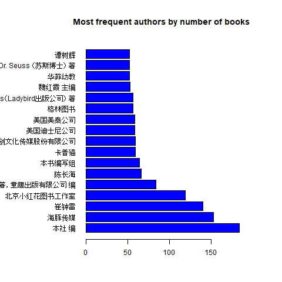

## Data
The data is downloaded from [dangdang.com](http://www.dangdang.com)  
and **sorted by:** 出版时间 (publishing date)  
**The filters are:**  
age: 3-6岁  
and three different categories:  

- activity and games 益智游戏
- children english 少儿英语
- preparation for school 入学准备

Example website: [activity and games](http://category.dangdang.com/cp01.41.02.13.00.00-srsort_pubdate_desc.html)


## Load Data and Preprocess
The file we are loading is from 2018-03-10 14:33.
```r
dang_file <- file.path(data_dir, 'dang_3cat_pdate_20180310_1433.csv')
strptime(regmatches(dang_file, regexpr('[0-9]{6}_[0-9]{4}', dang_file)),
         format = '%y%m%d_%H%M')
dang <- read.csv(dang_file,
                 fileEncoding = "UTF-8",
                 stringsAsFactors = FALSE)
dang$publishing_date <- as.Date(dang$publishing_date)
dang$book_title <- trimws(dang$book_title, which = 'left')
dang$鍙风爜 <- NULL
str(dang)
```
```
## data.frame':	16620 obs. of  11 variables:
##  $ product_id     : chr  "p25237642" "p25226960" "p25095867" "p25230304" ...
##  $ book_title     : chr  " 3～6岁幼儿学前专注力训练200题（全5册）" " 新编智慧折纸大全郭金洲老师作品，《儿童折纸大全》姐妹篇，极具中国特色形象大放送" " 越玩越聪明的数学游戏（共4册）" " 学前经典思维训练508题.5-6岁.上在思维中收获快乐,在训练中提高智商" ...
##  $ author         : chr  "智典棒棒糖" "郭金洲 宋秉武" "吴长顺" "歆音,露霖 编" ...
##  $ rating         : int  0 0 0 0 0 0 0 0 0 0 ...
##  $ num_comments   : int  0 0 0 0 0 0 0 0 0 0 ...
##  $ publisher      : chr  "中国纺织出版社" "中国纺织出版社" "中国科技出版传媒股份有限公司" "化学工业出版社" ...
## $ publishing_date: Date, format: "2018-05-01" "2018-04-01" "2018-03-09" ...
##  $ now_price      : num  99 27.3 108.3 19 55.2 ...
##  $ pre_price      : num  99 39.8 127.4 25 80.4 ...
##  $ detail         : chr  "3～6岁幼儿学前专注力训练200题（全5册）是一套培养儿童观察能力、在游戏过程中推进儿童专注力形成与发展的益智游戏书"| __truncated__ "《新编智慧折纸大全》特点 1.原创折纸形象，充满童趣，富有中国特色。 2.实力折纸专家，《*儿童折纸大全》等作品畅销多"| __truncated__ "著名数学游戏专家吴长顺老师新作，北京科委科普专项，著名儿童作家周莲珊作序推荐！全新趣题，震撼上市！一本让你爱不"| __truncated__ "人们通常以为孩子的智商是与生俱来的，难以改变，其实不然，后天的开发与孩子智商的发展密不可分。每个孩子都是独特的"| __truncated__ ...
##  $ categories     : chr  "activity" "activity" "activity" "activity" ...
##  - attr(*, ".internal.selfref")=<externalptr>
```
## 1.Variable product_id
It seems that DangDang is using an internal unique Product ID. This ID also refers to the detail page for each book. For example the book 'At the Park' *(DangDang's book title is quite different)* with product_id = 'p25171016' can be found with this page: [http://product.dangdang.com/25171016.html](http://product.dangdang.com/25171016.html)

 
## 2.Variable book_title
Not merely the title, but rather most information found on book cover.Often counts information about how many books there are in a set(e.g. '套装4册', '全12本', but maybe not '中国销量突破3,000,000册').
```r
set.seed(128)
sample_books <- sample(dang[dang$num_comments > 100, 1],8)
head(dang[dang$product_id %in% sample_books, 2], n = 8)
```
```
[1] "侦探保罗奇境冒险大迷宫（全8册）"
[2] "晨曦幼儿英语6（随书赠送教学VCD）"
[3] "宝宝蛋*幼小衔接整合教材+同步练习（全12本）"
[4] "幼小衔接思维升级训练（小班上册）"
[5] "迪士尼学而乐·数学奇迹课：形状和规律"
[6] "幼儿学前专注力训练100图(***-4阶段 共4册 套装 全套) 系统阶梯训练方式，活跃大脑思维，提高宝宝专注力，儿童"
[7] "360度幼小衔接.口算心算题卡.10以内加减法"
[8] "幼小衔接一日一练---数学2"
```
In future maybe worth to do some feature engineering, i.e. create a new variable for how many books in total belong to set. Some grep code here:
```r
grep('[0-9]+册', dang$book_title, value = TRUE)
dang[!grepl('[0-9]+册', dang$book_title) & grepl('册', dang$book_title),2]
grep('[0-9]+本', dang$book_title, value = TRUE)
grepl('[0-9]+册', dang$book_title)
```
 
## 3. Variable author
First have a look at most frequent authors:
```r
dang$author <- as.factor(dang$author)
summary(dang$author)
author_numbooks <- dang %>%
    group_by(author) %>%
    summarize(N = n()) %>%
    filter(N >= 55) %>%
    arrange(desc(N)) %>% as.data.frame()
head(author_numbooks, n = 20)
```
| author | N|
|:------|--:|
| 无 | 1232|
| "" | 233|
| 本社 编 | 184|
| 海豚传媒 | 153|
| 崔钟雷 | 140|
| 北京小红花图书工作室 | 119|
|（美）迪士尼公司 著，童趣出版有限公司 编 | 84|
| 陈长海 | 66|
| 本书编写组 | 64|
| 卡普猫 | 59|
|上海仙剑文化传媒股份有限公司 | 59|
| 美国迪士尼公司 | 58|
| 美国美泰公司 | 58|
| 格林图书 | 56|
| Ladybird Books（Ladybird出版公司） 著 | 56|
 The most frequent authors are "无" and "", i.e. the value is missing. Some 'authors' like "本社 编" most likely are not really authors  but organizations. etc.
Barplot of most frequent authors:
```r
png(file = 'figures/dang_eda_01_plot1.png', height = 480, width = 480)
par(mai=c(1,2,1,1))
with(author_numbooks[!author_numbooks$author %in% c('无', ''),],
     barplot(N, 
             names.arg = author,
             horiz = TRUE,
             col = 'blue',
             main = 'Most frequent authors by number of books',
             las = 1))
dev.off()
```
<!-- -->

There are 6000 books for both categories 'activity' and 'school_prep', because DangDang is restricted to 100 pages with 60 books each.  
For category 'child_english'  with 4620 books there are only 77 pages available. 
 
 ```r
 table(dang$categories)
 ```
 
 ```
## 
##      activity child_english   school_prep 
##          6000          4620          6000
```
